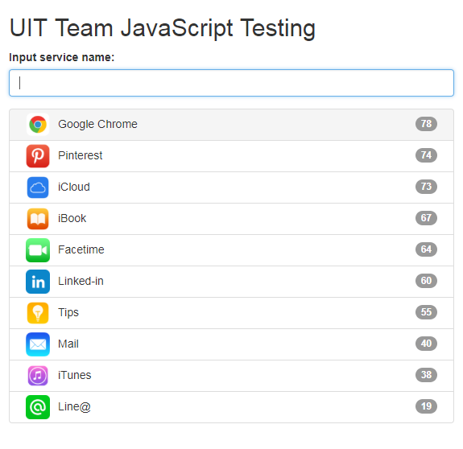

# Demo

# Features
1. Suggest apps each user input (if no input show all apps)
2. Support both keyboard & mouse selecting for PC browsers, and no conflict when using both.
    * Mouse: hover to highlight app, click to select app
    * Keyboard:
      * arrow up and arrow down: to highlight app
      * enter: to select app
      * esc: to hide apps and blur app input
    * When a new suggestion app list appears, and no highlight app
      * Press arrow down will highlight the first app
      * Press arrow up will highlight the last app
    * Allow to move from the last app to the first app when reachs the end of the list when press arrow down and vice versa 
3. Store data of selected app count to localStorage, will use this data to show apps order by most selected count (enable user to clear special search history item)
